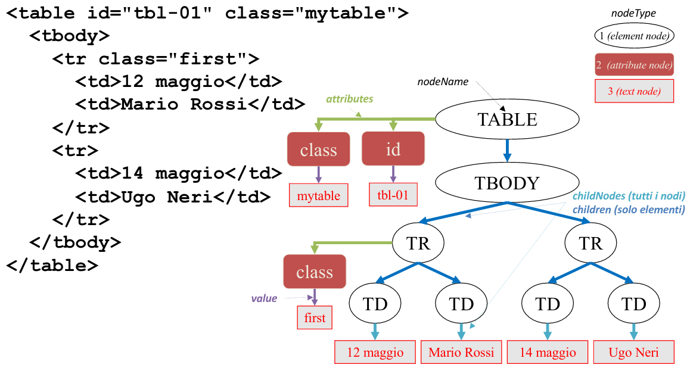

# Introduzione

## Standard e interoperabilità
- La prima informatica era contenta di un'applicazione che funzionasse e basta
- Con il tempo si sono introdotti concetti di qualità oltre al funzionamento
- **INTEROPERABILITÀ**: il programma deve funzionare con altri programmi dello stesso tipo
- Bisogna anche identificare degli standard appropriati e implementarli correttamente

## Mashup
- Capacità di unire linguaggi, protocolli, librerie, ecc. per creare qualcosa di complesso a partire da componenti semplici

## Dichiaratività
- La progettazione dichiarativa descrive stati iniziali e finali di un mondo astratto
  - Un meccanismo esistente genera la computazione che permette la transizione dallo stato iniziale al finale
  - Un errore porta ad uno stadio finale non desiderato, non ad un'interruzione

## Semanticità
- Le informazioni sul web hanno significato, un'applicazione che ne trae vantaggio collega e rende eseguibili informazioni semantiche non in "plain text"

## Accessibilità
- Il web rappresenta un mezzo di comunicazione universale, perciò è importante renderlo accessibile a tutti
- Soprattutto per persone con un qualche tipo di disabilità, ma anche persone in condizioni di disabilità temporanea

## Framework
- Librerie che rendono più ricco, sofisticato e semplice l'uso di una tecnologia, come un linguaggio (client/server-side) o le specifiche grafiche di una pagina web

## API
**Application Programming Interface**
- Librerie, protocolli e strumenti per utilizzare algoritmi e servizi messi a disposizione da un software da parte di un altro software
- Si ricorre ad esse per integrare più servizi in un'applicazione più ricca e potente di quelle utilizzate come base

### API REST
- RESTful API, sfruttano la natura di HTTP e degli URI
- Forniscono:
  - Un *URI* base a cui accedere ai servizi
  - Una *sintassi* degli URI delle entità interrogabili e modificabili
  - Un *media type* attraverso cui ottenere e fornire dati da utilizzare nei servizi forniti
  - Una *semantica* associata ai verbi HTTP (GET, PUT, POST, DELETE)

### API di servizi locali
- Permettono ad applicazioni web di accedere a servizi offerti dal device locale, come telecamera, microfono, geolocalizzazione, ecc

# I set di caratteri
Il problema della codifica dei caratteri

Digitalizzare un dato significa associarvi un numero. Digitalizziamo separatamente ogni componente
- Per un testo ogni singolo carattere
- Per le immagini ogni pixel

Il problema non si pone per i protocolli stessi, ma per il loro contenuto

I diversi alfabeti hanno diversi caratteri, che hanno generato problemi negli anni

## ASCII
***American Standard Code for Information Interchange***

Standard che definisce valori per 128 caratteri, nello standard originale su 8 bit il primo non è rilevante e viene usato come bit di parità

## ISO 8859/1 (ISO Latin 1)
È l'estensione standard (usa tutti gli 8 bit) e comprende un certo numero di caratteri di lingue europee

È usato automaticamente da HTTP e da alcuni OS

Retrocompatibile con ASCII

C'è però necessità di uno standard internazionale

## UNICODE (UCS)
Standard internazionale in uso oggi

- **Repertorio universale**
  - Tutti i caratteri di tutti gli alfabeti
- **Efficenza**
  - Raggruppamenti, allineamento e assenza di shift per uso di memorià e velocità di parsing
- **Caratteri, non glifi**
  - I font sono completamente esclusi
- **Semantica**
  - Ogni carattere possiede un significato specifico, anche se graficamente sono quasi uguali
- **Testo semplice**
  - Niente bold o alterazioni grafiche
- **Ordine logico**
  - Le sottosequenze di un alfabeto seguono l'ordine dell'alfabeto stesso
- **Unificazione**
  - Caratteri comuni a linguaggi diversi, se possibile, vengono unificati in un singolo codice
- **Composizione dinamica**
  - Alcuni caratteri sono composizione di frammenti indipendenti, questi frammenti hanno codici indipendenti e vengono creati per composizione
- **Stabilità**
  - I codici, una volta assegnati, non possono essere più rimossi
- **Convertibilità**
  - Facile meccanismo di conversione tra Unicode e altre codifiche precedenti

Avere tutti i caratteri permette di usare un unico standard dei caratteri online, ma ovviamente se scriviamo in Italia avere tutti i caratteri cinesi non sarà molto utile

Per esempio, UCS-2 usa 2 byte, UCS-4 usa 4 byte

## UTF
***Unicode Transformation Format***
È un sistema a lunghezza variabile che permette di accedere a tutti i caratteri di UCS in maniera più efficente

UTF-8 permette di accedere a tutti i caratteri definiti da UCS-4, ma utilizza una lunghezza variabile
- I codici ASCII a 7 bit richiedono un byte, mettendo a 0 il primo bit
  - Primo bit 0
- I codici per caratteri latini e script non ideografici richiedono 2 byte
  - Primi 2 bit 1
  - Ad ogni byte seguente i primi due bit sono 10
- I codici ideografici orientali richiedono 3 byte
  - Primi 3 bit 1
  - Ad ogni byte seguente i primi due bit sono 10
- Il resto 4 byte
  - Primi 4 bit 1
  - Ad ogni byte seguente i primi due bit sono 10

Convertire da ISO Latin 1 a UTF e viceversa può generare problemi. Infatti ISO Latin 1 usa sempre 1 byte, mentre UTF può usarne 2 per alcuni caratteri latini

# Content encoding
## Escaping
Il carattere proibito viene preceduto o sostituito da una sequenza di caratteri speciali
- `String c = "Questa stringa \"contiene\" caratteri speciali`
  - String c = "Questa stringa \"contiene\" caratteri speciali
- `<p>Questa stringa &quot;contiene&quot; caratteri speciali</p>`
  - <p>Questa stringa &quot;contiene&quot; caratteri speciali</p>

## Encoding
Il carattere proibito viene rappresentato numericamente con il suo codice naturale secondo una sintassi speciale
- `"felicit\u00E0"`
- `<p>felicit&#x00E0;</p>`
- `<p>felicit&#224;</p>`

## SMTP
***Simple Mail Transfer Protocol***
Uno dei protocolli TCP/IP più antico e ancora usato (1982)

Protocollo text-based, per scambio di messaggi di posta e la verifica dei destinatari dei messaggi

Una connessione SMTP è composta da un'apertura, una o più sequenze di comandi e da una chiusura

Limiti:
- Lunghezza massima del messaggio da 1 Mb
- Solo caratteri ASCII a 7 bit

Quindi non si possono trasferire documenti binari

**MIME** permette di bypassare questi limiti

## MIME
***Multipurpose Internet Mail Extensions***

MIME ridefinisce il formato del corpo di RFC 822 per permettere:
- Messaggi di testo con altri set di caratteri
- Messaggi non testuali
- Messaggi multi parte

Un messaggio MIME viene convertito in più messaggi SMTP compatibili per viaggiare, all'arrivo viene decodificato

    Eventualmente aggiungere altro

# Uniform Resource Identifier (URI)

**Identificazione**: Il WWW è uno spazio informativo in cui ogni elemento di interesse è chiamato risorsa ed è indentificato da un URI

**Interazione**: Un protocollo di comunicazione chiamato HTTP permette di scambiare messaggi su una rete informtica (TCP/IP)

**Formato**: Diversi formati, come XHTML, PNG, RDF, ecc.

Una **risorsa** è qualunque struttura che sia oggetto di scambio tra applicazioni all'interno del WWW

Nota: risorsa != file

Attraverso gli URI, il WWW è stato in grado di identificare risorse accessibili tramite il proprio protocollo, HTTP, e tramite tutti gli altri (FTP, ecc.). Il vantaggio rispetto ad altri sistemi è la sintassi universale, indipendente dal protocollo e facilmente memorizzabile

Gli URI si dividono in due gruppi:
- Uniform Resource Locatior (**URL**): contiene informazioni immediatamente utilizzabili per accedere alla risorsa (es. il suo indirizzo di rete)
- Uniform Resource Names (**URN**): permette un'etichettatura permanente e non ripudiabile della risorsa

Gli URL sono fragili, nel caso di cambio del nome di una directory non sono più validi

Gli URN sono stabili, ma vanno trasformati in URL per una ricerca, c'è una mappa che si aggiorna ad ogni modifica di una risorsa per fare ciò

Nella visione classica i due insiemi erano disgiunti, oggi invece la distinzione è secondaria
- Esempio: le coordinate geografiche sono sia un URL che un URN

## Sintassi
Gli URI sono progettati per:
- Essere trascrivibili: sequenze di caratteri tratti da un set limitato
- Fornire identificazione, non interazione: le operazioni eseguibli sulle risorse non sono indicate negli URI, ma nell'interpretazione che si fa di essi
- Fornire spazi di nomi organizzati gerarchicamente: Diverse parti divise da caratteri come ":", "/", "?" e "#"

Un URI è diviso in questo modo

`URI = schema : [// authority] path [? query] [# fragment]`
- **schema**: Negli URL è il protocollo (Es. http, ftp, https, mailto)
- **authority**: individua un'organizzazione gerarchica dello spazio dei nomi a cui sono delegati
  - A sua volta divisa in: `authority = [userinfo @] host [: port]
    - *userinfo* non deve essere per forza presente
    - *host* è il nome di un dominio o un indirizzo IP
    - *post* può essere omessa se si riferisce ad una well-known port
- **path**: parte identificativa della risorsa
- **query**: individua un'ulteriore specificazione della risorsa, solitamente per avere un risultato dinamico
- **fragment**: individua una risorsa secondaria

### Caratteri ammessi negli URI
Possono essere unreserved, reserved o escaped

#### Unreserved
Alfanumerici e punteggiatura privi di ambiguità

#### Reserved
Caratteri che hanno funzioni particolari, come ?, ;, /, &, ecc.

#### Escaped
- Per usarli è necessario usare %XX, dove XX è il codice esadecimale del carattere, sono:
  - Caratteri non US-ASCII
  - Caratteri di controllo
  - { } | \ ^ [ ] `
  - Delimitatori: spazio, <, >, #, %
  - Altri caratteri riservati

### Route
Associazione del *path* di un URI ad una risorsa gestita o restituita da un serber web.

- **Managed route**: il server associa ogni URI ad una risorsa attraverso il file system locale oppure generate attraverso una computazione
  - Approccio moderno, node.js ed express.js
- **File-system route**: il server associa la radice della parte *path* ad una directory del file system locale e ogni filename valido all'interno di quella directory genera un URI
  - Vecchio approccio

## URI references
Un URI assoluto contiene tutte le parti predefinite dal suo schema, esplicitamente precisate

Un URI gerarchico può però anche essere relativo, ed in questo caso riporta una parte dell'URI assoluto

Esempio: `pippo.html` dentro al documento di URI `http://www.sito.com/uno/due/pluto.html` fa riferimento a `http://www.sito.com/uno/due/pippo.html`

### Operazioni sugli URI
#### **URI Resolution**
Generazione dell'URL assouto corrispondente all'URI
Si esegue quando l'URI è una URI reference oppure un URI a cui non corrisponde una risorsa fisica
- Input: un URI - Output: un URI

#### **URI Dereferencing**
La fornitura della risorsa identificata dall'URI (Es. Il documento cercato)
- Input: un URL - Output: una risorsa

### Risolvere una URI reference
Risolvere un URI relativo avviene come segue

Dato l'URI di base `http://www.site.com/dir1/doc1.html`

| Input                                |  Risoluzione |
| :---                                 | :--- |
| `#anchor1`                           | `http://www.site.com/dir1/doc1.html#anchor1` |
| `http://www.site.com/dir2/doc2.html` | `http://www.site.com/dir2/doc2.html` |
| `/dir3/doc3.html`                    | `http://www.site.com/dir3/doc3.html` |
| `doc4.html`                          | `http://www.site.com/dir1/doc4.html` |
| `dir5/doc5.html`                     | `http://www.site.com/dir1/dir5/doc5.html` |
| `./doc6.html`                        | `http://www.site.com/dir1/doc6.html` |
| `../doc7.html`                       | `http://www.site.com/doc7.html` |

### Schemi HTTP e HTTPS
HTTPS differisce da HTTP per una crittografazione in entrambi i sensi, per il resto è uguale

#### **Sintassi**
`http://host[:port]/path[?query][#fragment]`

### Schema FILE
Dà accesso ai file di un file system locale

#### **Sintassi**
`file://host/path[#fragment]`

### Schema DATA
Schema non gerarchico, non fa riferimento ad una risorsa ma **contiene** una risorsa: tutti i dati sono inseriti nell'URI

#### **Sintassi**
`data:[<media type>][;base64];<data>`

Esempio: `data:text/plain;charset=UTF-8;some%20text%20for%20you`

### Schema FTP
File Trasfer Protocol

#### **Sintassi**
`ftp://[user[:password]@]host[:port]/path`

Dove:
- *User* e *Password* sono le credenziali per l'accesso al server FTP
  - Scarsa sicurezza, password in chiaro nell'URI
- *Host*, *port* e *path* sono l'indirizzo del server, la porta di connessione e il nome dell'oggetto ricercato, come per HTTP. La porta di default è 21

### URI che iniziano con //
Un URI reference può iniziare con un nome dominio:

    //www.sito.com/dir1/dir2/fig1.gif

Vuol dire quindi: "carica l'immagine `fig1.gif` utilizzando lo stesso protocollo della pagina HTML: HTTP se siamo fuori dall'area protetta o HTTPS se siamo dentro l'area protetta

### Content Delivery Network (CDN)

Ogni utente che naviga su molti siti web, che usano le stesse librerie ma non le prendono da un CDN deve scaricare tutte le volte gli stssi identici file.

Se invece questi siti fanno riferimento a librerie sullo stesso CDN, l'utente può usare le librerie scaricate una sola volta e mantenute in cache

### URL permanenti
Esistono schemi di URL che forniscono le garanzie richieste ad un URL per essere un URN. Un esempio è il PURL (Permanent URL)

L'accesso avviene per *derefenziazione* o per *redirezione*

### URL rewriting
Trasforma un URI visibile in un URL fisico sulla base di regole
- Esempio: `http://example.com/wiki/index.php?title=Argomento` può essere esposto come `http://example.com/Argomento`

Vantaggi
- Permette di nascondere dettagli sull'implementazione
- Permette di realizzare sistemi di nomi perduranti oltre la vita utile del software utilizzato

### URL shortener
Permettono di creare URL molto brevi a partire da URL lunghi. È un semplice rewriter

Esempi: bit.ly, tr.im, goo.gl

### application/x-www-form-urlencoded
È un'estensione della codifica degli URI applicata anche a risorse trasmesse su canale HTTP
- codici non alfanumerici -> `%XX`
- spazi -> `+`
- nomi dei controlli separati da `&`
- valore separato dal nome da `=`

Esempio, la parte queri di un URI usa questo formato *urlencoded*

### IRI
Internationalized Resource Identifier, fornisce una sintassi per inserire i caratteri di UCS-4 (UTF-8) in un URI e risolverli.

Per funzionare però c'è bisogno dei IDN

### IDN/IDNA
Internazionalized Domain Name for Application (IDN/IDNA), standart per estendere i nomi di dominio a tutti i caratteri non ASCII di Unicode

#### **Rischi**
Caratteri in cirillico sono estremamente simili a caratteri latini, possibilità di frodi

### CURIE
Compact URI, un modo per esprimere in maniera compatta famiglie di URI che condividono lo stesso prefisso

Esempio: Dato `dom="http://www.dominio.com/"`, con `[dom:doc1]` intendiamo `http://www.dominio.com/doc1`

### Linked Data
Collezione di dati leggibili sia da umani che da software. La collezione deve:
- Usare URI per identificare oggetti
- Usare HTTP URI per la ricerca
- Fornire informazioni utili sull'oggetto quando la sua URI è dereferenziata (Es. RDF)
- Includere link ad altre URI relative ai dati esposti per migliorare la ricerca di altre informazioni relative nel Web

### Linked Open Data (LOD)
Linked data di tipo aperto, utilizzabili da tutti. Sono usati molto da organizzazioni politiche per campagne

# HyperText Transfer Protocol (HTTP)
Procollo **client-server**, **generico** e **stateless** utilizzato non solo per lo scambio di documenti Web ma in molte applicazioni distribuite
- **Client-server**: il client attiva la connessione, il server la accetta e risponde, alla fine chiude la connessione
- **Generico**: indipendente dal formato dei dati con cui vengono trasmesse le risorse
- **Stateless**: il client ricrea da zero il contesto necessario al server per rispondere

## Risorse HTTP
HTTP permette lo scambio di risorse identificate da URI

Separa le risorse dallal loro rappresentazione

Implementa politiche di caching che permettono di memorizzare copie delle risorse sui server (proxy, gateway, etc.) coinvolti nella trasmissione e controllare la validità di queste copie

## Ruoli delle applicazioni HTTP
**Client**: Applicazione che stabilisce una connessione HTTP, con scopo di mandare richieste

**Server**: Applicazione ch eaccetta connessioni HTTP, che genera risposte

**User Agent**: Particolare client ch einizia una richiesta HTTP (tipicamente un browser)

**Origin server**: server che possiede fisicamente la risorsa

## Connessione HTTP
È composta da una serie di richieste e una serie corrispondente di risposte

Le connessioni sono **persistenti** con:
- **Pipeling**: trasmissione di più richieste senza attendere la risposta della precedente. Le risposte però arrivano in ordine
- **Multiplexing**: richieste e risposte in sequenza in ordine sparso, sono poi *ricostruite* dal client

## HTTP/2
Il *Multiplexing* è stato introdotto con HTTP/2

È la seconda major revision di HTTP, non è una riscrittura del protocollo ed è pensato per ridurre i tempi di latenza di HTTP

Ha introdotto il supporto ad operazioni di *Push* da parte del server

Stessi ruoli, verbi e headers di HTTP/1.1, i messaggi però non sono più plaintext ma compressi, e separando header da payload

## Richiesta HTTP
Si compone da:
- **Method**: azione del server richiesta dal client (Es. GET)
- **URI**: identificativo della risorsa *locale al server*
- **Version**: versione di HTTP
- **Header**: linee RFC822 divise in
  - Header *generali*
  - Header di *entità*
  - Header di *richiesta*/*risposta*
- **Body**: messaggio MIME

## Metodi HTTP (introduzione)
Indicano l'azione che il client richiede al server sulla risorsa (chiamati anche *verbi* HTTP)

Un uso corretto dei metodi HTTP aiuta a creare applicazioni interoperabili e in grado di sfruttare al meglio i meccanismi di caching di HTTP

Metodi principali: GET, HEAD, POST, PUT, DELETE, OPTIONS, PATCH

## GET
Viene attivato facendo click su un link ipertestuale o specificando un URL, usato per ricevere informazioni

    GET /courses/tw.html
    GET /students/123456/exams

## POST
Trasmette informazioni dal client al server relative alla risorsa identificata nell'URI

    POST /courses/1678
    {
        "titolo":"Tecnologie Web"
        "descrizione":"Il corso..bla..bla.."
    }

## Riposta HTTP
Composta da:
- Status code: indica se la richiesta è andata a buon fine
- Version: versione HTTP
- Header: uguale alla richiesta
- Body: messaggio MIME

## Status Code
Numero di 3 cifre, la prima indica la classe della risposta
- 1xx - Informational: Risposta temporanea della richiesta, ancora in svolgimento
- 2xx - Successful: Richiesta ricevuta, capita e accettata dal server
- 3xx - Redirection: Richiesta corretta, ma sono necessarie altre azioni da parte del client
- 4xx - Client error: Errore da parte del client
- 5xx - Server error: Errore dal parte del server (Nota: la richiesta potrebbe essere corretta)

Un uso corretto degli status code serve per costruire API chiare, così da non aver bisogno di leggere il body per sapere l'esito della richiesta

## Header
Righe di testo che specificano informazioni aggiuntive
| | Richiesta | Risposta |
| --- | --- | --- |
| Header Generali | Informazioni sulla trasmissione | Informazioni sulla trasmissione | 
| Header di entità | Informazioni sulla risorsa e i dati trasmessi | Informazioni sulla risorsa e i dati trasmessi |
| Header di richiesta/risposta | Informazioni sulla richiesta effettuata | Informazioni sulla risposta generata |

### Header Generali
Si applicano solo al messaggio trasmesso, non necessariamente alla risorsa trasmessa

Esempi:
- Date: data e ora della trasmissione
- Transfer-Encoding: formato di codifica
- Cache-Control: tipo di meccanismo di caching richiesto o suggerito
- Connection: tipo di connessione da usare

### Header dell'Entità
Informazioni sul body del messaggio o sulla risorsa specificata

Esempi:
- Content-Type: tipo MIME dell'entità nel body
- Content-Length: lunghezza in byte del body
- Content-Encoding: formato di codifica

### Header della Richiesta
Posti dal client per specificare informazioni sulla richiesta

Esempi:
- User-Agent: stringa che descrive il client
- Referer: URL della pagina originale da cui l'utente chiede il nuovo URL
- Host: nome del dominio e porta a cui viene fatta la connessione

### Header della Risposta
Posti dal server per specificare informazioni sulla risposta

Esempi:
- Server: stringa che descrive il server
- WWW-Authenticate: challenge utilizzata per i meccanismi di autenticazione

### Content-Type
Nel caso venga fornita un'entità in risposta gli header `Content-type`e `Content-length` sono obbligatori, così da processare correttamente la risorsa

## Metodi HTTP
<a href="Metodi HTTP (introduzione)">Introduzione</a>

### Proprietà dei metodi
#### **SICUREZZA**
Un metodo è sicuro se non genera cambiamenti dello stato interno del server

#### **IDEMPOTENZA**
Un metodo è idempotenete se l'effetto sul server di più richieste identiche è lo stesso di una singola richiesta

### GET
Sicuro e idempotente

### HEAD
Simile a GET, ma il server deve rispondere solo con gli header

Sicuro e idempotente

### POST
Trasmette informazioni al server riguardo ad una risorsa

Non è nè sicuro nè idempotente

### PUT
Trasmette informazioni al server, **creando o sostituendo** la risorsa specificata

PUT è idempotente ma non sicuro

### DELETE
Rimuove completamente una risorsa

Ammesso fare DELETE su una risorsa non esistente, non genera errore

È idempotente e non sicuro

### PATCH
Aggiorna parte della risorsa identificata

Modifiche incrementali, non sovrascrive la risorsa

PATCH non è nè sicuro nè idempotente

### OPTIONS
Usato per verificare *opzioni*, *requisiti* e *servizi* di un server, senza una richiesta vera e propria

Usato per il problema del **cross-site scripting** (CORS)

Sia sicuro che idempotente

### Riassumendo
| Metodo | Idempotenza | Sicurezza | 
| :--- | :---: | :---: |
| GET | YES | YES |
| HEAD | YES | YES |
| OPTION | YES | YES |
| DELETE | YES | NO |
| PUT | YES | NO |
| PATCH | NO | NO |
| POST | NO | NO |

# API REST
## API Web
*Application Programming Interface* Web

Descrive un'interfaccia HTTP che permette ad applicazioni remote di utilizzare servizi dell'applicazione

Il programmatore dell'applicazione server-side non dovrebbe sapere se la richiesta arriva da un modulo interno dell'applicazione o da una richiesta HTTP esterna

## Modello CRUD
*Pattern* tipico delle *applicazioni* di trattamento dei *dati*
- **Create**: inserimento nel database di un nuovorecord
- **Read**: accesso in lettura al database
- **Update**: aggiornamento di un campo di un oggetto
- **Delete**: rimozione di un oggetto dal database

## REST
**REpresentional State Transfer**, modello architetturale che sta dietro al WWW e dietro alle applicazioni "ben fatte" secondo i progettisti di HTTP

Applicazioni non REST si basano sulla generazione di un API che specifica le funzioni messe a disposizione dell'applicazione, e alla creazione di un'interfaccia **indipendente dal protocollo** di trasporto e ad essa **completamente nascosta**

Un'applicazione REST invece si bassa sul protocollo di traspoorto e di naming (HTTP e URI) per generare interfacce **generiche** di interazione, e **fortemente connesse** con l'ambiente d'uso

### Architettura REST
1. Definire **risorsa** ogni concetto rilevante dell'applicazione Web
2. Associagli un **URI** come **identificatore**
3. Usare i **verbi HTTP** per esprimere ogni **operazione** secondo il modello **CRUD** (PUT, GET, POST, DELETE)
4. Esprimere in maniera *parametrica* ogni rappresentazione dello **stato interno** della risorsa

Nelle applicazioni non REST (applicazioni SOAP) esiste un intermediario di messaggi <br>
La richiesta è indirizzata a questo intermediario e contiene nel body tutte le informazioni per soddisfarla, HTTP usato solo per trasferire informazioni

L'archiettura REST si basa sui tre pressuposti del Web:
1. Ogni *entità* definita come *risorsa*. L'URI è il suo identificatore (**nome**)
2. Ogni *interazione* è esprimibile con un *metodo HTTP* (**verbo**)
3. Ciò che viene scambiato è una *rappresentazione di uno stato* della risorsa (**formato**)

REST infatti *non è un nuovo protocollo*, ma un modo di di sfruttare a pieno HTTP

### Esempio
Crea Cliente

    PUT clients/1234 HTTP/1.1
    Host: http://www.sito.com:80
    Content-Type: text/xml; charset=utf-8
    Content-length: 474
  
    <client xmlns:m="http://www.myApp.com/">
        <nome>Rossi S.p.A.</nome>
        <tel>051 654321</tel>
        <citta>Bologna</citta>
    </client>

Aggiorna Cliente

    PUT clients/1234 HTTP/1.1
    Host: http://www.sito.com:80
    Content-Type:application/json; charset=utf-8
    Content-length: 474
    
    {
        "nome": "Rossi S.p.A.",
        "tel" : "051 654321",
        "citta" : "Bologna"
    }

### Organizzazione risorse REST

REST identifica due concetti fondamentali: **individui** e **collezioni**
- Fornisce un URI ad entrambi
- Ogni operazione avviene su uno solo di questi concetti
- Su entrambi posso eseguire operazioni CRUD

È consigliabile strutturare gli URI in modo gerarchico

Esempio
- `/clients/` -> tutti i clienti
- `/clients/1234/` -> il cliente 1234
- `/clients/1234/orders/` -> tutti gli ordini del cliente 1234

Linee Guida:
- Collezioni -> nome plurale, in fondo /
  - Es. `/customers/123/`, tutte le sottorisorse del cliente 123
- Individui -> nome singolare, in fondo niente /
  - Es. `/customers/123`, solo il cliente 123

Un filtro genera un sottoinsieme specificato attraverso una regola di qualche tipo
- Esempio: `/customers/?tel=0511234567` -> collezione di clienti con tel 0511234567

Nota: `POST /customers/` genera un cliente nuovo senza poter scegliere l'id, per farlo bisogna usare `PUT /customers/123`

### Versionamento API
REST non ha uno standard, si può inserire nell'URI, ma viola l'idea di identificare una singola risorsa con un URI<br>
Questo è il sistema più semplice e intuitivo, ma gli URI si "sporcano"
- `http://api.miosito.com/v1/clients/1234`

L'alternativa è usare gli header HTTP `Accept` e i meccanismi di *content negotiation* per specificare la versione di API supportata.<br>
Così gli URI sono più puliti ma la complessità aumenta:
- `Accept: application/vnd.example.v1+json`
- `Accept: application/vnd.example+json;version=1.0`

# OpenAPI
Per documentare una API è necessario definire:
- **end-point** (URI/route) che supporta
- **metodi** HTTP di accesso
- **rappresentazioni** di **Input/Output**
- **condizioni di errore** e mesaggi relativi

## Swagger
Ecosistema di tool per creazione, documentazione e accesso ad API soprattutto REST

Può essere serializzato in JSON o YAML, è lo standard industriale per API REST

## YAML
**Ain't a Markup Language**, linearizzazione di strutture dati con sintassi ispirata a Python

È più leggibile di JSON, ma i principi base sono uguali

## Esempio di OpenAPI
    swagger: "2.0"
    info:
        description: "This is a ..."
        version: "1.0.6"
        title: "Swagger Petstore"
        termsOfService: "http://swagger.io/terms"
        license:
            name: "Apache 2.0"
            url: "http://www.apache.org/licenses/LICENSE
    host: "petstore.swagger.io"
    basePath: "/v2"     ## Utile per le versioni
    tags:
        ...
    schemes:
    - "https"
    - "http"
    paths:              ## End-point (operazioni)
        ...
    
    securityDefinitions:
        ...
    
    definitions:        ## Definizioni risorse
        ...

## Sezione `paths`
Descrive i percorsi (URL) corrispondenti alle operazioni possibili sull'API
- Struttura: `<host>/<basePath>/<path>`

Per ogni `path` ci sono tante sottosezioni quante sono le operazioni, per ognuna:
- Informazioni generali
- Paramentri di input/output

### Esempio
    /pet/{petId}:
        get:
            summary: "Find pet by ID"
            description: "Returns a single pet"
            operationId: "getPedById"
            produces:
            - "application/xml"
            - "application/json"
            parameters:
                ...
            responses:
                ...
        post:
            summary: "Updates a pet in the store with form"
            description: ""
            operationId: "updatePetWithForm"
            consumes:
            - "application/x-www-form-urlencoded"
            produces:
            - "application/xml"
            - "application/json"
            parameters:
                ...
            responses:
                ...

## Paramentri di input
Descritti nella sezione `parameters` che definisce una *lista* di paramentri, ognuno con:
- tipo del parametro
  - keyword `in`, può assumere valori `path`, `query` o `body`
- nome (`name`) e descrizione (`description`)
- se è obbligatorio (`required`)
- formato dei valori che il dato può assumere (`type` o `schema`)

I tipi in input e output possono essere di vario tipo
- Primitivi: interi, stringhe, date, booleani
- Oggetto (nel body)
- Array di oggetti o dati primitivi

### Esempio `path` e `query`
    /pet/{petId}:
        get:
            summary: Find pet by ID
            description: Returns a single pet
            operationId: getPedById
            parameters:
                - name: petId       ## Quello nell'URI
                  in: path
                  description: ID of pet to return
                  required: true
                  type: integer
                  format: int64

    /pet/:
        get:
            summary: Find pet by status
            operationId: findPetsByStatus
            parameters:
                - name: status       ## Quello nella query dell'URI
                  in: query
                  description: Status values that need to be considered for filter
                  required: true
                  type: array
                  items:
                      type: string

### Esempio `body`
    /user/{username}:
        put:
            tags:
                - user
            summary: Updated user
            description: This can only be done by the logged in user.
            operationId: updateUser
            parameters:
                - name: username
                  in: path            ## Parametro nel path
                  description: name that need to be updated
                  required: true
                  type: string
                - in: body
                  name: body          ## Oggetto <User> nel body
                  description: Updated user object
                  required: true
                  schema:
                      $ref: '#/definitions/User'

## Oggetti e definizioni
Il body contiene un oggetto di tipo `User`, viene passata l'intera risorsa come parametro

La sezione `definitions` permette di definire i tipi degli oggetti, le loro proprietà e possibili valori

Possono essere referenziati sia nelle richieste che nelle risposte (con `schema -> $ref`)

### Esempio
    User:
        type: object
        proprerties:
            id:
                type: integer
                format: int64
            username:
                type: string
            firstName:
                type: string
            lastName:
                type: string
            emale:
                type: string
            password:
                type: string
            phone:
                type: string
            userStatus:
                type: integer
                format: int32
                description: User Status

## Output
Definiti attraverso `responses`

Ogni risposta ha un id numerico unico, associato al codice HTTP corrispondente
- 200 nessun errore
- 4xx vari errori relativi

### Esempio
    /pet/:
        get:
            summary: Find pet by status
            operationId: findPetsByStatus
            parameters:
                - name: status
                  in: query
                  description: Status values that need to be considered for filter
                  required: true
                  type: array
                  items:
                      type: string
            responses:
                '200':
                    description: Successful operation
                    schema:
                        type: array
                        items:
                            $ref: '#/definitions/Pet'
                '400':
                    description: Invalid status value

# Markup
Ogni mezzo per rendere esplicita una certa interpretazione del testo

Esempio, aggiunte al testo scritto che permettono di renderlo più fruibile. Come puteggiatura, spaziatura, ecc.

## Introduzione e modi di Markup
...

## Componenti del markup
### Elementi
Parti del documento dotate di un senso proprio
Individuato da un tag iniziale, il contenuto e il tag finale
- `<titolo>Tre uomini e una barca</titolo>`

### Attributi
Informazioni aggiuntive all'interno del tag
- `<racconto tipo="romanzo"> ... </racconto>`

### Entità
Frammenti di documento memorizzati separatamente e richiamabili all'interno del documento
- `&egrave;`

### #PCDATA
Parsed Character DATA, rappresenta il contenuto vero e proprio del documento

### Commenti
Testo ignorato in fase di parsing
- `<!-- Questo testo è ignorato dal parser -->`

### Processing Instructions
Elementi particolari per dare specifiche ulteriori su come gestire il documento XML nel caso specifico
- `<?newpage?>`

## XML
Extended Markup Language, è un formato di Markup

Distingue i documenti **validi** dai documenti **ben formati**

# HTML
HyperText Markup Language, la versione attuale è la 5

## Struttura
```
<!DOCTYPE html>
  <html>
    <head>
      <title>Document title</title>
    </head>
    <body>
      <p>Text of a paragraph</p>
    </body>
  </html>
```

`<!DOCTYPE html>`: segnala il tipo di markup usato nel suo documento e la sea versione

## Elementi *inline*
Non spezzano il blocco (non vanno a capo) e si includono liberamente uno dentro l'altro

Si dividono in elementi *fontstyle* e *phrase*. Oggi si consiglia l'uso di CSS. Esempi:
- TT - TeleType, font monospace
- I - corsivo
- B - grassetto
- U - sottolineato (deprecato)
- S e STRIKE - testo barrato (deprecato)
- BIG o SMALL - testo più grande o più piccolo
- ecc

## Elementi di blocco
Definiscono l'esistenza di blocchi di testo che contengono elementi *inline*

Elementi fondamentali
- `<p>`: paragrafo
- `<div>`: blocco generico
- `<pre>`: blocco preformattato
- `<address>`: l'autore della pagina
- `<blockquote>`: citazione lunga

Blocchi con ruolo strutturale
- `<h1>`, `<h2>`, ..., `<h6>`: header

## Elementi di lista
Liste di elementi omogenei:
- `<ul>`: Unordered List
  - Lista non ordinata di elementi `<li>` (list item)
- `<ol>`: Ordered List
  - Lista ordinata di elementi `<li>`
- `<dl>`: Definitions List
  - Lista di elementi `<dt>` (definition term) e `<dd>` (definition data)

## Elementi generici
`<div>` e `<span>` sono cosiddetti elementi generici, privi di caratteristiche predefinite.

`<div>` per gli elementi blocco, `<span>` per gli elementi inline

## Effetti grafici
`<hr>` horizontal rule
`<br>` break (line)

## Elementi di struttura
`<main>` la parte principale della pagina. Al suo interno troviamo:
- `<section>`, un contenitore generico
- `<article>`, una parte del documento *self-contained*

`<aside>`, una sezione collegata al testo ma separata dal flusso principale

`<header>` e `<footer>`, elementi iniziali e finali di un documento
- `<header>` contiene l'intestazione della sezione corrente o dell'intera pagina
  - Solitamente usato pe rtabelle di contenuti, indici, form, ecc.
- `<footer>` contiene la parte conclusiva
  - Usato per mostrare informazioni sugli autori della pagina, copyright, licenze, ecc.

`<nav>`, liste di navigazione
- Nota, molto utile per l'accessibilità

## Link ipertestuali (anchors)
Definiti con elementi `<a>`, sintatticamente elementi *inline* (Ma non possono annidarsi a vicenda)

Attributi:
- `href`: specifica l'URI di destinazione
- `name`: specifica un nome che può essere usato come ancora di destinazione di un link

## Immagini
Definite da ``. Elemento vuoto, definito completamente dai suoi attributi:
- `src` (required): URL della risorsa
- `alt`: testo alternativo
- `name`: un nome per riferirsi all'immagine
- `width`: forza la larghezza in pixel
- `height`: forza l'altezza in pixel

`<figure>` contiene una `` e un `<figcaption>`

## Tabelle
Vengono specificate **riga per riga** da `<table>`, `<tr>` (table row), `<th>` (table header) e `<td>` (table data)

Gli attributi `colspan` e `rowspan` permettono di occupare più celle (terribili per l'accessibilità)

## Form
Legate ad applicazioni server-side. Vengono inviati tramite una connessione HTTP
- `<form>`: contenitore del form
  <br>Attributi:
  - `method`: metodo HTTP da usare
  - `action`: URI dell'applicazione server-side da chiamare
- `<input>`, `<select>`, `<textarea>`: widget del form
  <br>Attributi:
  - `name`: nome legato all'applicazione server-side
  - `type`: tipo di widget (input, checkbox, radio, submit, cancel, etc.)
- `<button>`: un bottone cliccabile
- `<label>`: parte visibile del widget

Nota: per `input` ci sono due attributi per il focus
- `placeholder`: contiene una stringa di visualizzata in trasparenza nel campo
- `autofocus`: indica il campo sul quale posizionare il focus al caricamento del form
- `email`: verifica (il browser) che ci sia una mail
- `url`: verifica che ci sia un URL
- `number`: bottoni per aumentare o diminuire il numero
- `range`: slider per incrementare un numero, specificando max e min
- `date`: visualizzazione di un calendario
- e altri

È permesso *validare* il form client-side (è il default)

Possibile indicare i campi obbligatori, tramite l'attributo `required` nell'oggetto `input`

## Attributi globali (coreattrs)
- **Id**: un identificativo unico
- **Style**: breve stile CSS associato al singolo elemento
- **Class**: una lista di nomi di classe per CSS
- **Title**: testo secondario associato all'elemento

### Attributi i18n (internationalization) e di eventi
- **Lang**: codifica dei linguaggi umani
- **Dir**: direzione da cui leggere il testo, `ltr` (left-to-right) o `rtl` (right-to-left)
- **Onclick**, **ondoubleclick**, **onmouseover**, **onkeypress**, ecc.

## Colori
Gestiti con **codice hash** RGB o con nome esplicito

## Tipi di dati: le lunghezze
HTML usa diversi modi per gestire le lunghezze:
- **Pixel**: dimensione in putni di schermo, è un numero assoluto
- **Percentuali**: dimensione in proporzione rispetto alla dimensione del contenitore
- **Multi-lunghezze**: sequenza di valori di lunghezza, si usa per esempio nei gruppi di colonne in una tabella

## Tag di `<head>`
- `<title>`: titolo del documento
  - Contiene del semplice testo, ha tre scopi: appare come titolo della finestra, nome per un eventuale bookmark e per i motori di ricerca
- `<link>`: link di documenti a tutto il documento
  - Si utilizza per collegare altri documenti al documento principale (vedi `script` e `style`)
- `<script>`: librerie di script
- `<style>`: librerie di stili
- `<meta>`: meta-informazioni sul documento
  - Codifica dei caratteri utilizzata (`<meta charset="utf-8">`)
  - Intestazioni HTTP (`<meta http-equiv="expires" content="Sat, 23 Mar 2019 14::25:27 GMT">`)
  - Altre informazioni per il motore di ricerca
- `<base>`: URL da usare come base per gli URL relativi
  - Inserimento di un URL relativo, che si basa sull'URL del documento di partenza

## `<object>`: embedded content
Elementi come `<canvas>`, `<audio>`, `<video>`, `<math>`, ecc

### Canvas
`<canvas>` fornisce un'area rettangolare in cui disegnare immagini bidimensionali e modificarle in relazione ad eventi, con javascript

Esempio:
```
function draw() {
  var canvas = document.getElementById('c1');
  if (canvas.getContext) {
    var ctx = canvas.getContext('2d');
    ctx.fillStyle = "rgb(255, 0, 0)"
    ctx.fillRect (20, 20, 65, 60);
    ctx.strokeStyle = "rgb(0, 100, 20)";
    ctx.strokeRect (40, 40, 65, 60);
  }
}

<canvas id=”c1" onLoad="draw();" width="175" height="175">
</canvas>
```

### Video e audio
HTML5 permette di includere video e audio in una pagina

`<video>` specifica un meccanismo generico per il caricamento di *file* e *stream* video <br>
`<audio>` funziona uguale

Esempio:
```
<video width="400px" controls autoplay>
  <source src="video.mp4" type="video/mp4" codecs="avc1.42E01E, mp4a.40.2">
  <source src='video.ogv' type='video/ogg" codecs="theora, vorbis">
  <track kind="subtitles" src="video.en.vtt" srclang="en" label="English">
  <track kind="subtitles" src="video.it.vtt" srclang="it" label=”Italian">
</video>
```

## Il Document Object Model (DOM)
Il parsing di HTML5 è complesso, può essere fatto anche per documenti mal formati, ma i vari browser lo facevano in modo diverso

Nasce quindi una struttura chiamata Document Object Model (DOM) a cui sia possibile arrivare a partire dalla stringa HTML e da cui sia possibile estrarne un'altra successivamente

Il DOM è un'**interfaccia di programmazione** (API) per documenti HTML e XML

Definisce la struttura logica del documento con una struttura ad albero. Esempio:



### Oggetti del DOM
La classe principale è *DOMNode*, di cui la maggior parte delle altre classi ne sono sottoclasse (ce ne altri):
- DOMDocument: l'intero documento
- DOMElement: uno o più elementi singoli
- DOMAttr: ogni singolo attributo del documento
- DOMText: ogni singolo nodo di testo del documento

#### **DOM Node**
Specifica i metodi per accedere a tutti gli elementi di un nodo di un documento

Membri:
- `nodeName` - *uppercase string*
- `nodeType` - *number*
- `childern` - *array*
- `childNodes` - *array*
- `parentNode` - *elementNode*
- `attributes` - *array*

Metodi:
- `insertBefore()`
- `replaceChild()`
- `removeChild()`
- `appendChild()`
- `hasChildNodes()`
- `hasAttributes()`

#### **DOM Document**
Equivalente alla radice dell'albero (non all'elemento radice)

Membri:
- `docType`
- `documentElement`

Metodi
- `createElement()`
- `createAttribute()`
- `createTextNode()`
- `getElementsByTagName()`
- `getElementById()`

#### **DOM Element**
Accede a qualunque elemento del documento

Membri:
- `nodeName`

Metodi:
- `getAttribute()`
- `setAttribute()`
- `removeAttribute()`

E analogamente per le altre classi ed interfaccia del DOM

### Selettori in DOM
Per accedere ai nodi i metodi standard sono:
- `getElementById`: id univoco
- `getElementsByName`: attributo nome
- `getElementsByTagName`: ricerca con tag (`div`, `h1`, ecc)
- `getElementsByClassName`: ricerca tramite classe
- `querySelector`: accetta selettore CSS e restituisce il primo elemento che trova
- `querySelectorAll`: come prima ma restituisce tutti gli elementi trovati

### `innerHTML` e `outerHTML`
Solo per HTML (non in generale):
- `innerHTML` legge/scrive il contenuto di un sottoalbero, quindi *esclude* il tag
- `outerHTML` legge/scrive il contenuto di un elemento, quindi *include* il tag

# CSS e tipografia
    Lunga introduzione

## Tipometria
Unità assolute:
- Point (`pt`): definito come 1/72 di un pollice, 0.35 o 0.37 mm
- Millimetri (`mm`)
- Inch (`in`): 1 pollice = 25.4 mm

Unità relative:
- `Em`: la dimensione del carattere attuale
  - Deriva dalla larghezza del blocco con cui veniva stampata la M
  - Se la dimensione corrente è `12pt` allora `1em = 12pt`
- `En`: metà di 1 `em`
- `Ex`: l'altezza di una x minuscola

## RGB
Spazio colore additivo basato sull'identifcazione di Rosso, Verde e Blu come colori primari

### RGBa
Derivato da RGB, aggiunta del *canale alpha* per l'opacità

## Cascading Style Sheet (CSS)
Foglio di stile **a cascata**

Nei documenti HTML l'uso di stili CSS può usato in tre modi
- direttamente dentro al tag di riferimento
- dentro al tag `<style>`
- indicato un foglio a parte dentro a `<link>`

Per indicare gli elementi si usa:
- Il nome dell'elemento (`body`, `h1`, ecc)
- La classe, con `.nomeClasse`
- L'id, con `#idElemento`

Gli elementi vengono presi a cascata, l'ultimo sovrappone tutti gli altri (con delle eccezioni)

La proprietà è una caratteristica di stile assegnabile ad un elemento<br>
Esempio: `color`, `font-family`, `margin`, ecc

Uno statement è indicazione di una proprietà CSS. Ha la sintassi `proprietà: valore;`
```
color: blue;
font-family: "Times New Roman";
margin: 0px;
```

